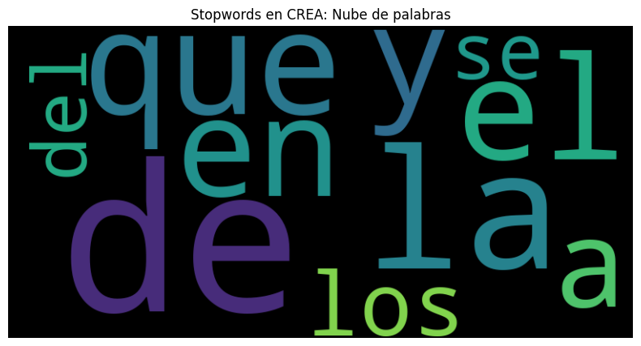
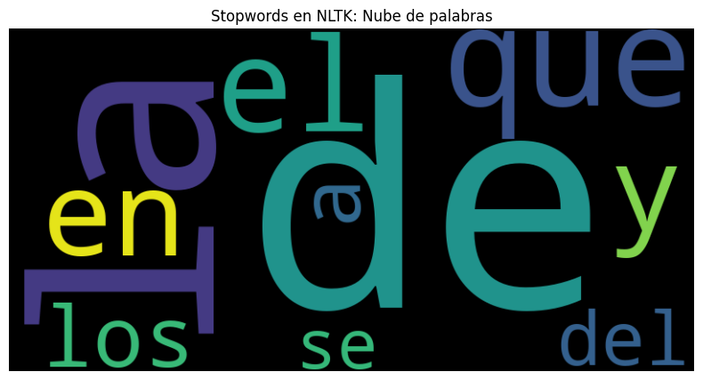
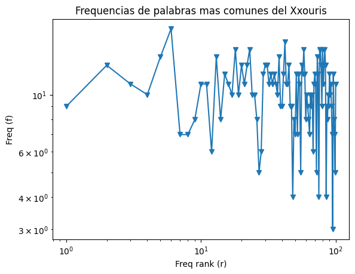

# Práctica 3: Propiedades estadísticas del lenguaje natural
Implementada por Alejandro Axel Rodríguez Sánchez (@Ahexo)  
Lingüística computacional (2024-2, 7014)  
Facultad de Ciencias UNAM  

## Cómo ejecutar

1. Se recomienda generar un entorno virtual de Python (al menos 3.9).
```sh
python3 -m venv practica3
source practica3/bin/activate
```

2. Instalar las bibliotecas requeridas, se puede usar el archivo `requirements.txt` para esto:
```sh
pip install -r requirements.txt
```

3. Ejectuar el script `practica3.py`.
```sh
python practica3.py
```

## Detalles

En el script de Python se dan mas detalles de la realización de las actividades, aquí unicamente se muestra un resumen de resultados para contestar puntualmente los requerimientos de la práctica.

## Cuestionamientos

### Actividad 1: Nubes de palabras




> [Al comparar las stopwords de ambos corpus del español] ¿Obtenemos el mismo resultado? Si o no y ¿Porqué?

### Actividad 2: Ley de zipf para lenguas artificiales

El Xxöuris es un lenguaje artifical generado con las siguiente reglas:

1. Tiene un conjunto de vocales (a,u,e,o,y,x) las cuales pueden tener grafías como la dieresis (ä,ë,ö,ü,ÿ,ẍ) o el acento (á,é,ó,ú,ý, la x no tiene), las cuales representan un hipotético tono que tendría nuestro lenguaje.
2. El resto de letras del alfabeto latino serán nuestras consonantes.
3. Las palabras del lenguaje se componen de combinaciones de sílabas (una consonante con una vocal) o de vocales sueltas.
4. Tiene oraciones que se generan concatenando palabras con espacios que siguen las reglas anteriores.

#### Ejemplo de palabras del Xxöuris
ẍxäáoözvgfm', 'ööÿsmc', 'ouëüdik', 'ueäyunjdh', 'éuẍÿẍörrgrs', 'xj', 'éüvd', 'aühq', 'ëéf', 'öur'.

#### Ejemplos de oraciones del Xxöuris
* ýp at eẍẍtrm ẍxäáoözvgfm aäyhdt ýẍq áÿééffg xẍýẍbvv ý ëéf.  
* ýp ýp aál.  
* u ööÿsmc ouëüdik ä üuq oöi áeüxëksjp ü ý.  
* öur ouëüdik.  
* üuq ÿóẍdv xj úuv úög ëẍáyjir ëáöxëdghj  



Sin embargo, al analizar las frecuencias y longitudes de palabras de este lenguaje, nos encontramos con que esta **no cumple con la ley de Zipf**.  Ni la longitud promedio de los tipos más frecuentes es mas del doble de las mas frecuentes, ni la distribución de las frecuencias se aproxima a la distribución de Zipf.

Esto puede deberse a que el modelado del lenguaje que estamos haciendo es muy simplista: únicamente nos estamos preocupando de generar cadenas de palabras que asemejen en apariencia la estructura sintáctica de un idioma, obviando otros atributos como la semántica o la pragmática del lenguaje, los cuales determinan mas atributos que si se ven reflejados en patrones como la Ley de Zipf, de Heap, entre otros.